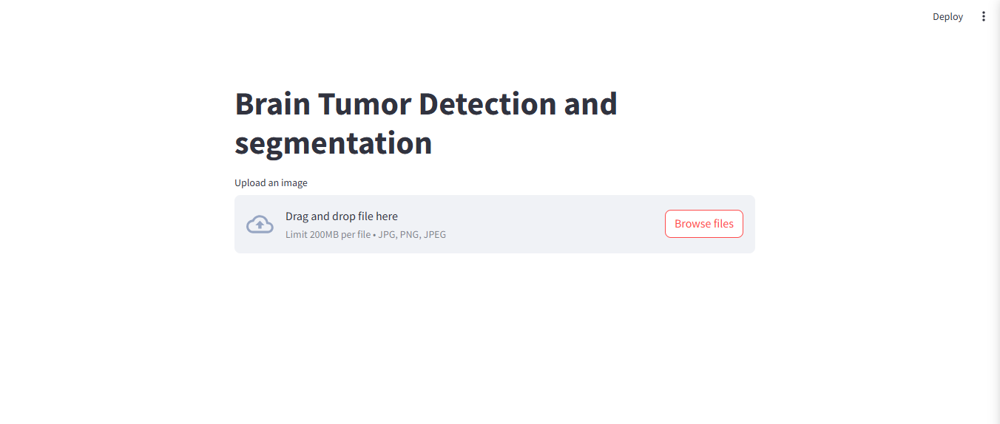

# Brain Tumor Detection & Segmentation Web App

**Detect and segment brain tumors in MRI scans with ease.**

**Features:**

* Upload MRI images (JPEG, PNG).
* AI-powered tumor detection.
* Precise tumor segmentation.
* Simple, user-friendly interface.

**Demo Image:**

  

**Setup:**

1.  Clone: `git clone [repo_url]`
2.  Create env: `python -m venv venv; source venv/bin/activate`
3.  Install: `pip install -r requirements.txt`
4.  Place models (`detection_model.h5`, `segmentation_model.h5`) in `models/`
5.  Place your demo image (`demo_image.png`) in the root folder.

**Run:**

* `streamlit run app/main.py`

**Usage:**

1.  Upload image.
2.  Click "Perform Inference".
3.  View results.

**Dependencies:**

* `streamlit`, `tensorflow`, `Pillow`, `numpy`

**Models:**

* TensorFlow Keras models for detection and segmentation.

**Acknowledgements:**

* This project utilizes datasets generously provided by:
    * **Detection Dataset:** [https://www.kaggle.com/datasets/navoneel/brain-mri-images-for-brain-tumor-detection/data]
    * **Segmentation Dataset:** [https://www.kaggle.com/datasets/mateuszbuda/lgg-mri-segmentation/data]
    We extend our sincere gratitude for making this research and application possible.
* We also thank the open-source community for their contributions to TensorFlow, Streamlit, and other essential libraries.
